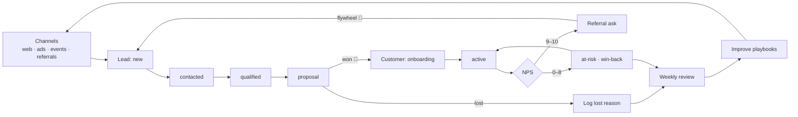

# CRM Home

The hub for the leads → customers → referrals experience. The visual journey lives in
[[Customer Experience Flow.canvas|Customer Experience Flow]]; the live data lives in the
dashboard below. The whole point of this system is the loop at the bottom of this note:
**measure the experience → spot friction → improve it → repeat**.

## The journey at a glance

## The data model

Every record is a plain note tagged `#crm` with a `type` property. Create them from
the [[Lead Template]], [[Customer Template]], [[Referral Template]], and
[[Touchpoint Template]].

| Type | Key properties | Lifecycle (`status`) |
|------|----------------|----------------------|
| `lead` | `source`, `referrer`, `value`, `last_contact`, `next_action`, `next_action_date` | `new` → `contacted` → `qualified` → `proposal` → `won` / `lost` |
| `customer` | `health`, `nps`, `since`, `last_contact`, `next_review`, `referrals_given` | `onboarding` → `active` ↔ `at-risk` → `churned` |
| `referral` | `referrer`, `referred`, `date`, `reward` | `invited` → `contacted` → `converted` / `lost` |
| `touchpoint` | `about`, `date`, `channel`, `sentiment`, `follow_up`, `follow_up_date` | — |

Relationships are wikilinks: a referral links its `referrer` (customer) and `referred`
(lead); every touchpoint links `about`; a won lead becomes a customer note that keeps
the history. Backlinks give you the full story on any record.

## Live dashboard

![[CRM Dashboard.base#Follow-ups Due]]

![[CRM Dashboard.base#Lead Pipeline]]

![[CRM Dashboard.base#At Risk]]

![[CRM Dashboard.base#Referrals]]

Full dashboard with all views: [[CRM Dashboard.base|CRM Dashboard]]
(also: Customers, Recent Touchpoints).

## The improvement loop (weekly, ~20 min)

1. **Follow-ups Due → zero.** Every overdue `next_action` gets done or rescheduled today.
2. **At Risk → one action each.** Win-back call, check-in, or escalation — never just watch.
3. **Referrals → follow through.** Thank new referrers, chase `contacted`, send `pending` rewards.
4. **Lost reasons → patterns.** Read this week's lost notes; if a reason repeats twice, change something (pricing page, proposal template, qualification questions).
5. **Capture one improvement.** Update a template, a playbook, or the canvas. Small, every week.

> [!tip] Experience metrics to watch on the dashboard
> - **Days Since Contact** creeping up on active customers = silent churn risk
> - **NPS average** trend across customers
> - **Referral conversion** (`converted` vs `invited`) — the flywheel's health
> - **Pipeline value** by `source` — double down on what converts
